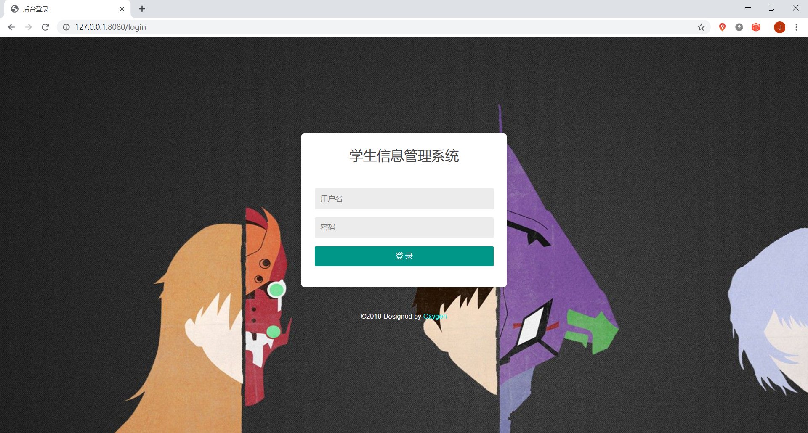
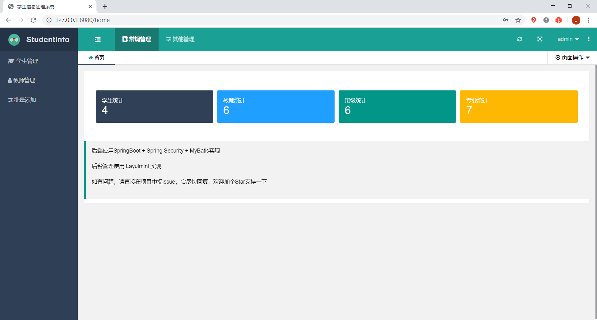
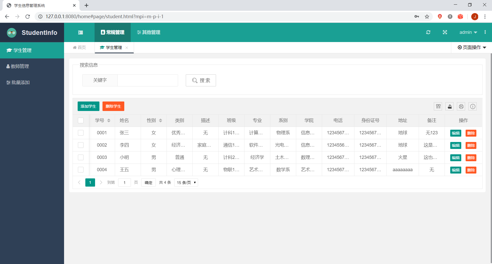
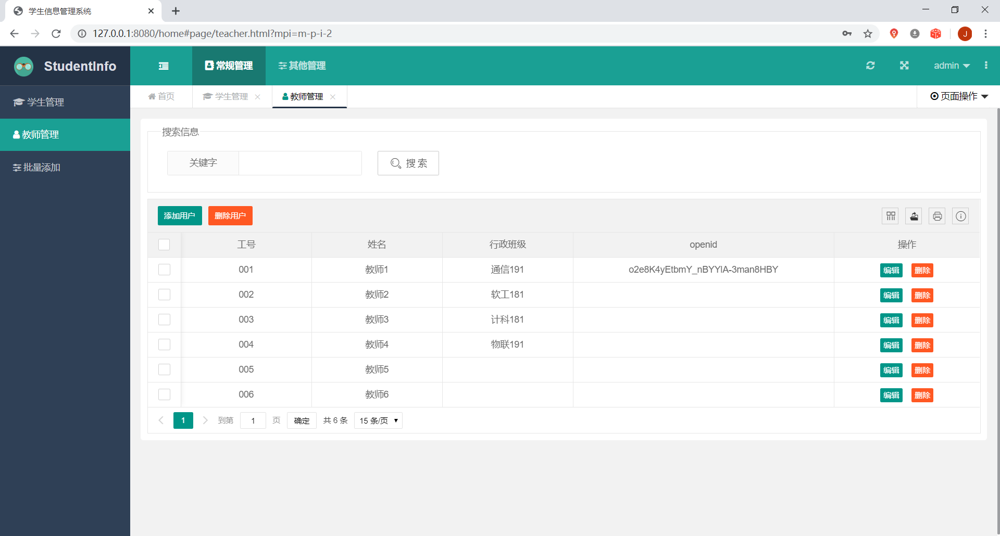
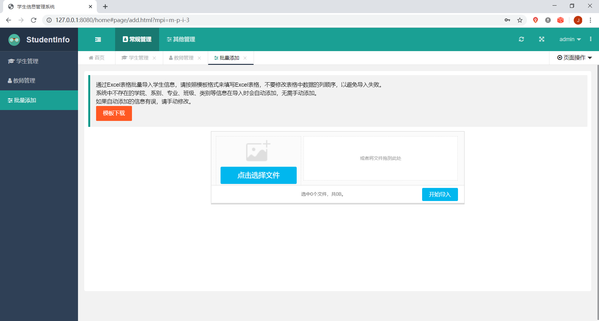
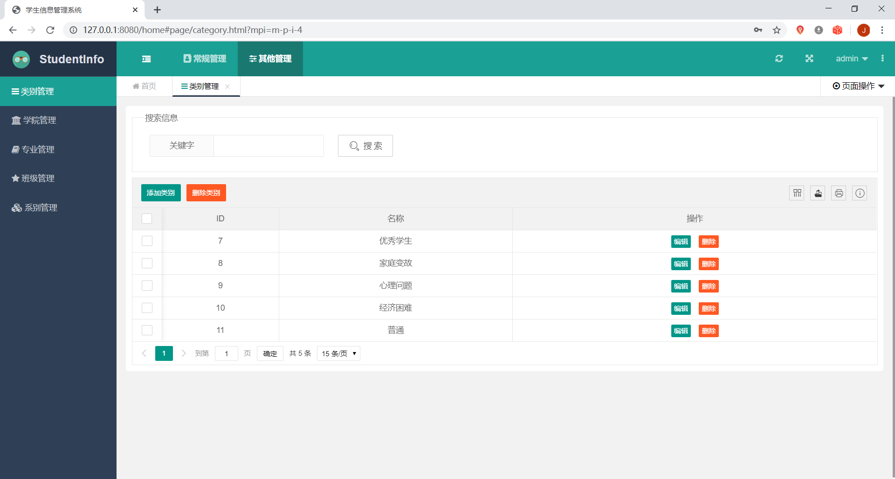

# 学生管理系统——后端
学生管理系统后端，基于SpringBoot + Spring Security + Mybatis实现，后台管理页面使用layuimini模板，项目正在完善中，开发环境：MySQL 5.5 + Java 8  + IDEA，
使用opeid（同一微信号在不同的小程序中有不同的openid）作为用户身份认证，一定程度上确保数据安全。

<del>目前仅实现了基本功能，维护数据还需要手动使用sql来维护</del>，因为赶进度，没有打印日志，计划后续添加，欢迎各位大佬来添砖加瓦~


## Todo-List

- [x] 完成基本功能，可上线使用
- [x] 完善后端其他功能<br/>
- [ ] <del>使用Redis或Ehcache做缓存，减轻数据库压力</del>
- [x] 添加管理页面，方便添加、修改数据
- [x] 添加批量导入数据的功能
- [x] 添加Controller层日志打印，便于后续的运维
- [ ] 添加Service层日志打印，便于后续的运维


## 部署说明

**请使用jar包方式进行部署，目前war包部署存在问题。**


项目为微信小程序后端，需要搭配 [学生管理系统小程序端](https://github.com/weingxing/StudentInfo-fronted) 使用，克隆项目到本地，导入IDEA，修改数据库连接地址、用户名、密码等信息，导入数据库文件到数据库，数据库**studentinfo.sql**文件位于 **src/sql** 目录，修改**src\main\java\com\oxygen\studentinfo\config\WechatSK.java** 中的**APP_ID**和**SECRET** 为你的微信小程序APP_ID和SECRET，源码中使用 "XXXXXXX" 代替，不修改将无法正常使用微信小程序。运行mvn中的package命令，将项目打包为jar文件，可直接上传到服务器，通过

```shell
nohup java -jar 打成的jar文件名  >temp.txt &
// 这种方法会把日志文件输入到你指定的文件中(temp.txt)，没有则会自动创建。进程会在后台运行。
```

命令运行，也可以修改pom.xml文件，打成war包，利用Tomcat部署。


为减轻服务器压力，可使用阿里云OOS等作为图床，项目中图片地址为后台**根据学号生成（域名地址+学号+文件后缀 的格式）**并插入数据库，数据库中保存的是图片的地址，可修改**config目录下的PhotoAddress.java**中的**domain**来修改图片的域名地址。

请在使用微信小程序绑定工号和姓名前，向数据库中提前导入待绑定的工号和姓名，不要导入openid字段，默认为Null即可，绑定时会先查询工号和姓名是否存在，数据存在且openid为空，可以绑定，否则提示 **没有权限**

后台登录**用户名为 admin，密码为 123456**，密码可以登陆后在后台修改，用户名目前需要手动修改数据库中user表。

后台登录页面向后端发送用户名和密码时，密码采用RSA加密传输，如果要更改密钥，可使用**util/RSAUtil.java**生成新的密钥对，然后将私钥内容填写在**config/RSAKey.java**，公钥内容填写现在**resources/static/js/util.js**中的**pubkey**


## 数据安全

因为微信小程序为前后端分离，为确保后端数据安全，目前采取的方法是每次请求接口都要带上openid，如果数据库中存在openid，则返回数据，否则一个Response类对象。


## 运行截图













